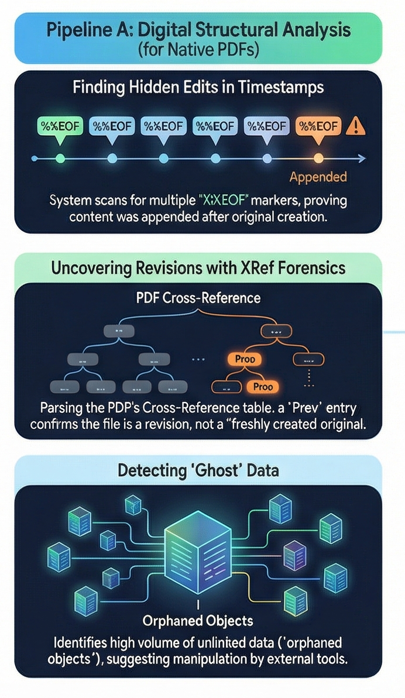
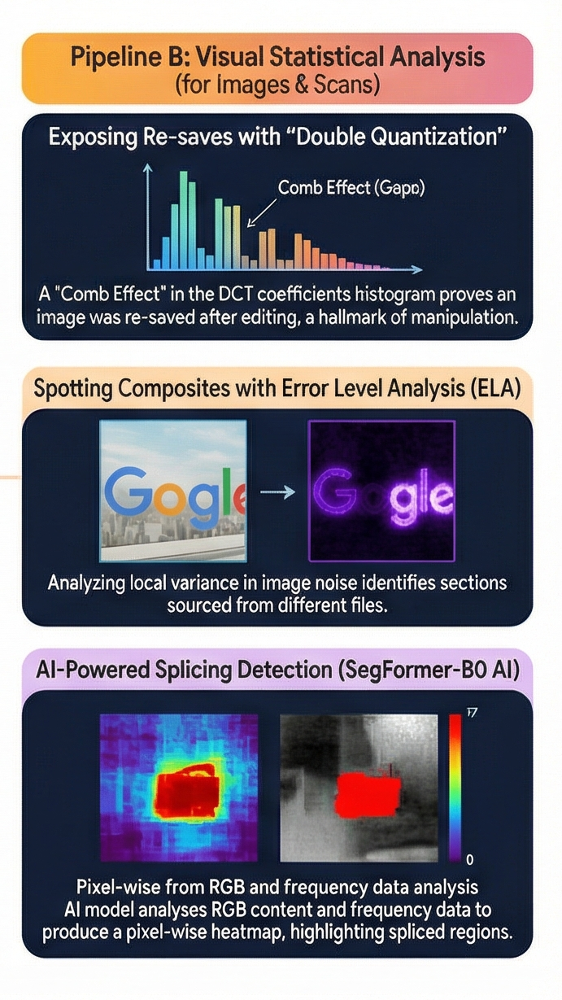

# Veridoc: Conditional Forgery Detection System


> **A Dual-Modality Forensic Engine on Google Cloud Platform**

## 📖 Overview

The rapid democratization of advanced digital editing tools has rendered traditional document verification obsolete. Organizations now face invisible threats where metadata manipulation, pixel-perfect splicing, and deep-fake technologies bypass standard visual checks.

**Veridoc** addresses this critical need for a dual-modality forensic engine capable of interrogating both the "binary DNA" of a file and its "visual physics" to mathematically prove authenticity rather than relying on subjective human review.

---

## 🏗 System Architecture

The system operates on a **Conditional Logic Model**, utilizing a Python (FastAPI) orchestrator to route files to specific analysis pipelines based on their format. This prevents redundant processing and maximizes detection accuracy.

### 🕵️‍♂️ Pipeline A: Digital Structural Analysis
*   **Target:** Native PDFs (digitally generated documents).
*   **Methodology:** Deterministic Binary File Structure Parsing & Deep Content Inspection.
*   **Libraries Used:** `pypdf`



#### Key Techniques Implemented:
1.  **Incremental Update & XRef Analysis:** We scan raw file bytes for multiple `%%EOF` markers and disjointed Cross-Reference (`xref`) tables. A count > 1 indicates that the file has been "incrementally updated" or spliced after initial creation.
2.  **Deep Image Inspection:** Automatically extracts embedded images from PDF pages and routes them to the **Visual Forensics Lab** (Pipeline B) to detect if a signature or stamp was pasted in.
3.  **Hidden Payload Detection:** Scans the document structure for "Orphaned" objects, Embedded Files, and JavaScript. These are strong indicators of malicious payloads or hidden/deleted content.
4.  **Metadata Forensics:** Extraction of file metadata to identify suspicious producers (e.g., "Phantom", "GPL Ghostscript") often used in document manipulation tools.

<br>

### 👁️ Pipeline B: Visual Statistical Analysis
*   **Target:** Scanned documents, JPEGs, Screenshots, and Extracted PDF Assets.
*   **Methodology:** Statistical Signal Processing & Deep Learning.
*   **Libraries Used:** `opencv-python`, `numpy`, `torch`, `transformers`, `trufor`



#### Key Techniques Implemented:
1.  **TruFor (True Forensics):** Integrates the state-of-the-art **TruFor** engine (Noiseprint++ / CMX) to generate high-fidelity anomaly heatmaps. This detects splicing by analyzing camera sensor noise inconsistencies invisible to the naked eye.
2.  **Semantic Segmentation:** Utilizes a **SegFormer-B0** model (fine-tuned on DocTamper) to perform pixel-level tampering detection, specifically trained to spot copy-move forgeries in document layouts.
3.  **Noise Variance Analysis:** visualizing high-frequency noise distribution to spot pasted regions that have a different noise profile than the background.
4.  **Error Level Analysis (ELA):** Re-saves images at known quality (90%) to highlight compression artifacts. High difference scores indicate manipulation.
5.  **Double Quantization:** Analyzes histogram periodicity to detect if an image has been decompressed and re-compressed.

<br>

### 🔐 Pipeline C: Cryptographic Verification
*   **Target:** Digitally Signed PDFs (Contracts, Certificates).
*   **Methodology:** Mathematical verification of Chain of Trust.
*   **Libraries Used:** `pyhanko`, `cryptography`

#### Key Techniques Implemented:
1.  **Signature Integrity:** Validates that the document hash has not been altered since signing.
2.  **Trust Verification:** Checks if the certificate root is trusted or if it is a self-signed (untrusted) certificate.
3.  **Revocation Status:** Checks if the certificate has been actively revoked.

<br>

### 🧠 Universal Layer: Unified Forensic Reasoning
Executed if pipelines find ambiguous results, this layer serves as the final "Logical Gatekeeper".

*   **Technology:** **Google Vertex AI (Gemini 2.5 Flash)**.
*   **Methodology:** Single-Shot Forensic Analysis.
*   **Process:** The system sends the document analysis report to the Gemini 2.5 Flash model with a specialized system prompt acting as an "Expert Forensic Auditor". The model analyzes the content for logical inconsistencies and returns a structured verdict.
*   **Libraries Used:** `google-cloud-aiplatform`, `vertexai`.

---

## 🚀 Setup Instructions

### Prerequisites
- Python 3.8+
- Node.js 16+ (for frontend)
- `wget` or `curl` (for model download)

### Backend Setup

1. **Clone the repository**
   ```bash
   git clone https://github.com/yourusername/veridoc_gfg_jan26.git
   cd veridoc_gfg_jan26/backend
   ```

2. **Create and Activate Virtual Environment**
   It's recommended to use a virtual environment to manage dependencies.
   
   **Linux/macOS:**
   ```bash
   python3 -m venv venv
   source venv/bin/activate
   ```
   
   **Windows:**
   ```bash
   python -m venv venv
   .\venv\Scripts\activate
   ```

3. **Install Python dependencies**
   ```bash
   pip install -r requirements.txt
   ```

4. **Download TruFor model weights** (Required for visual forensics)
   
   The TruFor model weights (~249 MB) are downloaded from the official repository:
   
   **Option A: Using bash script (Linux/Mac)**
   ```bash
   bash scripts/setup_trufor.sh
   ```
   
   **Option B: Using Python script (Cross-platform)**
   ```bash
   python scripts/setup_trufor.py
   ```
   
   This downloads `trufor.pth.tar` from the official [TruFor repository](https://github.com/grip-unina/TruFor) maintained by GRIP-UNINA.

5. **Start the backend server**
   ```bash
   uvicorn main:app --reload
   ```

### Frontend Setup

1. **Navigate to frontend directory**
   ```bash
   cd ../frontend
   ```

2. **Install dependencies**
   ```bash
   npm install
   ```

3. **Start the development server**
   ```bash
   npm run dev
   ```

---

## 💻 Technical Specifications & Libraries

VeriDoc leverages a robust logic-based ecosystem for deterministic analysis and API orchestration.

| Component | Library / Tool | Purpose |
| :--- | :--- | :--- |
| **Frontend** | `React 19`, `Vite`, `TailwindCSS` | Modern, responsive UI with real-time analysis dashboards. |
| **Orchestration** | `fastapi`, `uvicorn` | High-performance async API for handling concurrent analysis requests. |
| **Structural** | `pypdf` | Parsing PDF internal structure, extracting images, and detecting incremental updates. |
| **Visual (Deep)** | `torch`, `transformers` | Running SegFormer and TruFor deep learning models. |
| **Visual (Signal)** | `opencv-python`, `numpy` | High-speed matrix operations for ELA and noise analysis. |
| **Cryptographic** | `pyhanko`, `cryptography` | ASN.1 parsing and X.509 certificate validation. |
| **AI Inference** | `google-cloud-aiplatform` | Interface for Vertex AI and Gemini models. |

---

## ☁️ GCP Infrastructure & Deployment strategy

The architecture is built on a **Serverless First** principle using Google Cloud Platform to ensure high availability and security.

1.  **Local Ingestion:** Fast, local checks (Pipelines A/B/C) run on the application server (Cloud Run) to filter obvious fakes without incurring AI costs.
2.  **Secure Staging:** Files are uploaded to **Google Cloud Storage (GCS)** buckets with strict lifecycle policies.
3.  **AI Analysis:** Vertex AI accesses the file directly from GCS (`gs://...` URI), ensuring data never leaves the secure cloud perimeter during analysis.

---

## 📈 Expected Impact


*   **Defensible Verification:** Moves analysis from subjective suspicion to mathematical proof (e.g., EOF markers, Signature validation, TruFor Heatmaps).
*   **Explainable AI (XAI):** Provides detailed reasoning via Gemini's analysis, rather than just "black box" confidence scores.
*   **Operational Velocity:** Automates the initial forensic pass, reducing manual review time significantly.
